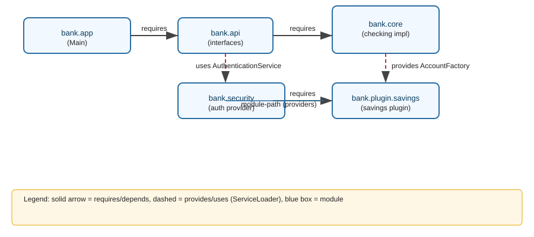
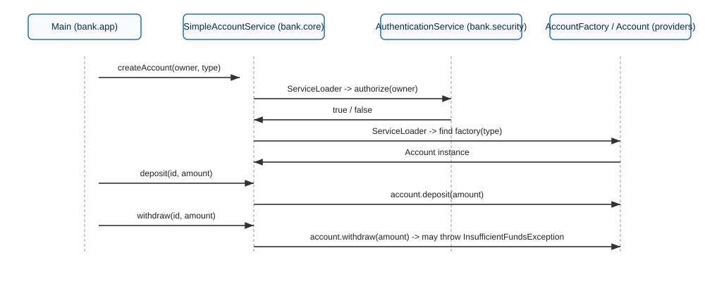
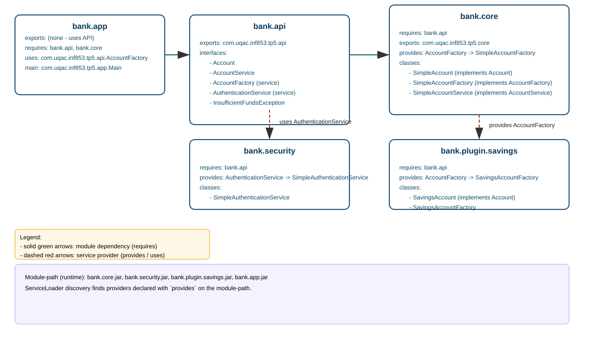

JPMS TP — Système bancaire modulaire (Java 9+)

Structure du projet

- bank/
  - src/
    - bank.api/
      - module-info.java
      - com/uqac/inf853/tp5/api/* (interfaces et exceptions)
    - bank.core/
      - module-info.java
      - com/uqac/inf853/tp5/core/* (implémentations)
    - bank.security/
      - module-info.java
      - com/uqac/inf853/tp5/security/* (impl simple)
    - bank.plugin.savings/
      - module-info.java
      - com/uqac/inf853/tp5/plugin/savings/* (plugin d'exemple)
    - bank.app/
      - module-info.java
      - com/uqac/inf853/tp5/app/Main.java

But : les fichiers sources sont sous `src` ; les packages sont `com.uqac.inf853.tp5.*`.

Objectif

Expliquer et démontrer le Java Platform Module System (JPMS) avec un exemple simple :
- séparation interface/impl
- encapsulation via exports
- découverte de services avec ServiceLoader
- plugins (ex: comptes "savings")

Commandes (PowerShell, Windows)

Compilation (depuis la racine du projet `bank`, celui qui contient `src`)

```powershell
Remove-Item -Recurse -Force .\out -ErrorAction SilentlyContinue
New-Item -ItemType Directory -Path .\out | Out-Null

# Liste des .java
$javaFiles = Get-ChildItem -Path .\src -Recurse -Filter *.java | ForEach-Object { $_.FullName }

# Compiler tous les modules en une seule passe
javac --module-source-path src -d out $javaFiles
```

Exécution

```powershell
java --module-path out -m bank.app/com.uqac.inf853.tp5.app.Main
```

Si `java` ou `javac` n'est pas trouvé, utilisez le chemin complet vers votre JDK (exemple pour JDK 17 installé par défaut)

```powershell
& 'C:\Program Files\Java\jdk-17\bin\javac.exe' --module-source-path src -d out $javaFiles
& 'C:\Program Files\Java\jdk-17\bin\java.exe' --module-path out -m bank.app/com.uqac.inf853.tp5.app.Main
```

Créer des jars modulaires (optionnel)

```powershell
jar --create --file out\bank.api.jar -C out\bank.api .
jar --create --file out\bank.core.jar -C out\bank.core .
jar --create --file out\bank.security.jar -C out\bank.security .
jar --create --file out\bank.plugin.savings.jar -C out\bank.plugin.savings .
jar --create --file out\bank.app.jar -C out\bank.app .

java --module-path out -m bank.app/com.uqac.inf853.tp5.app.Main
```

Remarques pédagogiques

- Les interfaces et exceptions sont dans `bank.api` et exportées.
- Les implémentations sont dans `bank.core` et `bank.plugin.savings` qui fournissent des services via `provides`.
- `bank.app` consomme les services via `ServiceLoader` (déclaré `uses`).
- `bank.security` fournit une impl simple d'`AuthenticationService`.

Prochaines étapes possibles

- Générer un `pom.xml` ou `build.gradle` pour automatiser la compilation et les tests.
- Ajouter des exercices et corrigés.
- Ajouter des tests JUnit modulaires.


Fichier(s) principaux

- `src/bank.api/com/uqac/inf853/tp5/api/*.java`
- `src/bank.core/com/uqac/inf853/tp5/core/*.java`
- `src/bank.security/com/uqac/inf853/tp5/security/*.java`
- `src/bank.plugin.savings/com/uqac/inf853/tp5/plugin/savings/*.java`
- `src/bank.app/com/uqac/inf853/tp5/app/Main.java`

Diagrams

Module graph (module relationships) and sequence diagram (create/deposit/withdraw) are provided in the `diagrams/` folder:





Detailed diagrams (colored, with package & class details) are also available:




Converting SVG -> PNG (local instructions)

If you want PNG files, convert locally using one of these tools (install Inkscape or ImageMagick):

Inkscape (recommended):
```powershell
# convert module graph
& 'C:\Program Files\Inkscape\inkscape.exe' diagrams/module-graph-detailed.svg --export-type=png --export-filename=diagrams/module-graph-detailed.png
& 'C:\Program Files\Inkscape\inkscape.exe' diagrams/sequence-diagram-detailed.svg --export-type=png --export-filename=diagrams/sequence-diagram-detailed.png
```

ImageMagick (convert):
```powershell
magick convert diagrams/module-graph-detailed.svg diagrams/module-graph-detailed.png
magick convert diagrams/sequence-diagram-detailed.svg diagrams/sequence-diagram-detailed.png
```

If conversion tools are not installed on this machine, you can open the SVG directly in a web browser or editor (Inkscape, Illustrator).

